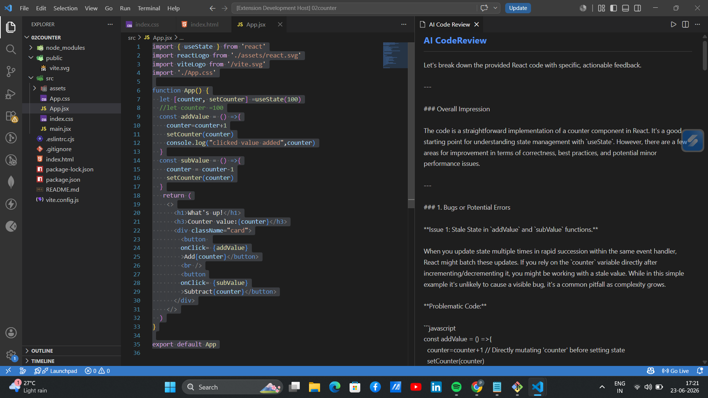

# AI Code Explainer — VS Code Extension

A VS Code extension that explains, reviews, and documents 
code using Google Gemini AI — directly in your editor.

## Features
- **Ctrl+Shift+E** — Explain selected code in a side panel
- **Ctrl+Shift+R** — Get actionable code review with 
  improvement suggestions
- **Ctrl+Shift+D** — Auto-generate documentation/docstrings
- Right-click context menu integration for all 3 commands

## Tech Stack
- TypeScript (VS Code Extension API)
- Google Gemini API (gemini-2.5-flash-lite)
- VS Code Webview API for the results panel

## How It Works
1. Select any code in the editor
2. Press Ctrl+Shift+E (or right-click → AI: Explain)
3. The AI explanation appears in a panel on the right
   without leaving your editor

## Setup
1. Clone the repo
2. Run `npm install`
3. Get a free Gemini API key at aistudio.google.com
4. Create `.env` file: `GEMINI_API_KEY=your_key_here`
5. Press F5 to launch in development mode

## Screenshots

## Why I Built This
Built as a portfolio project to understand how AI coding
assistants work under the hood — specifically how VS Code
extensions access editor context and render AI responses
in Webview panels. Directly relevant to how tools like
Sypha AI, GitHub Copilot, and Cursor are built.
